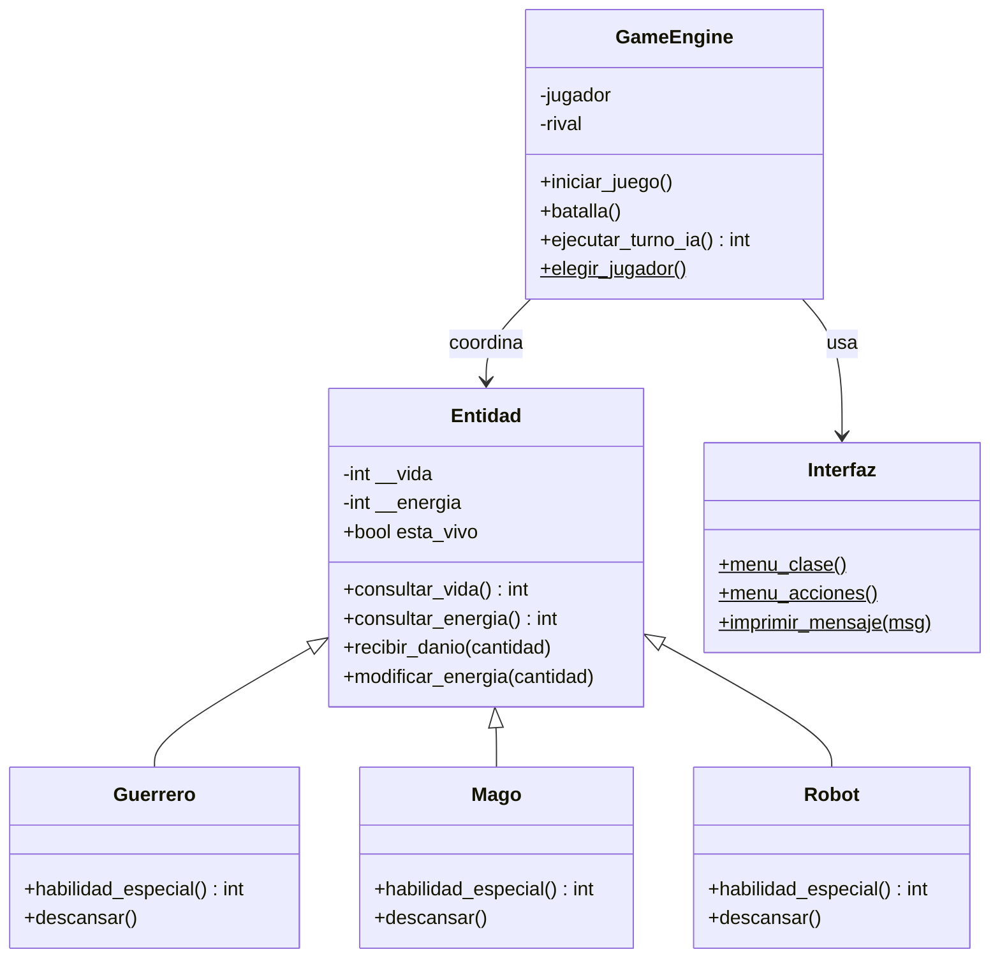

# 🐧 Penguin Academy — Battle Simulator

Simulador de combate por turnos desarrollado en **Python puro**, creado como resolución del challenge *"Penguin Academy"*. El objetivo no era solo hacer que el juego funcione, sino demostrar un diseño de software correcto: **estructura, jerarquía y responsabilidades claras**, aplicando los cuatro pilares de la Programación Orientada a Objetos.

> "En Penguin no sobrevivís escribiendo funciones sueltas. Los sistemas reales necesitan estructura, jerarquía y diseño."

---

## 📋 Descripción

El jugador elige una unidad (Guerrero, Mago o Robot) y se enfrenta en combate por turnos contra un rival controlado por una IA simple: **ROBOT CENTINELA X9**. Cada turno se elige una acción (ataque básico, habilidad especial o descanso) y el sistema resuelve el intercambio de daño hasta que uno de los dos combatientes cae.

## 🎮 Demo

```
--- SELECCION DE PERSONAJE ---
1. Guerrero | 2. Mago | 3. Robot
Selecciona tu unidad: 1
Elige el nombre de tu heroe: TestHero

[ TestHero HP: 150 EN: 50 ] vs [ ROBOT CENTINELA X9 HP: 200 EN: 80 ]

¿Qué deseas hacer?
1. Ataque Básico
2. Habilidad Especial
3. Descansar
Acción: 1
>> Hiciste 20 de daño !!!
>> El rival te hizo 30 de daño.

[ TestHero HP: 120 EN: 50 ] vs [ ROBOT CENTINELA X9 HP: 180 EN: 55 ]
...
```

## 🏗️ Arquitectura

El proyecto está dividido en **3 zonas lógicas independientes**, cada una en su propio módulo, sin lógica de juego flotando en `main.py`:

```
penguin-academy-battle/
├── dominio.py     # Capa de Dominio → entidades del juego y sus reglas
├── motor.py       # Capa de Motor  → GameEngine (loop, turnos, coordinación)
├── interfaz.py    # Capa de UI     → impresión de estado y lectura de inputs
├── main.py        # Punto de entrada → arma el sistema y lo ejecuta
└── README.md
```

`main.py` no contiene condicionales ni reglas: únicamente instancia los objetos necesarios (`GameEngine`, `Robot` rival) y arranca el loop. Toda la decisión de "qué pasa cuando ataco / uso habilidad / descanso" vive dentro de las clases correspondientes.

### Diagrama de clases



## 🧱 Pilares de POO aplicados

**Abstracción**
`Entidad` es la clase base del sistema y funciona como contrato: define qué significa "ser un personaje" (tener vida, energía, poder recibir daño), pero no tiene sentido por sí sola. Se bloquea su instanciación directa dentro de su propio `__init__`, obligando a trabajar siempre a través de una subclase concreta.

**Herencia**
`Guerrero`, `Mago` y `Robot` heredan de `Entidad` y reutilizan toda la lógica común (vida, energía, recibir daño) sin reescribirla.

**Polimorfismo**
Las tres subclases implementan `habilidad_especial()` y `descansar()` con comportamiento propio. `GameEngine` llama a `self.jugador.habilidad_especial()` sin saber (ni necesitar saber) qué clase concreta hay detrás — el objeto correcto responde según su propio tipo.

**Encapsulamiento**
`__vida` y `__energia` son atributos privados (name mangling de Python). No se puede tocar `heroe.__vida` desde afuera de la clase: toda modificación pasa obligatoriamente por `recibir_danio()` o `modificar_energia()`, que además contienen las reglas de negocio (tope de vida en 0, tope de energía entre 0 y 100).

## ⚔️ Personajes

| Clase | Vida | Energía inicial | Habilidad especial | Costo | Daño | Descanso |
|---|---|---|---|---|---|---|
| Guerrero | 150 | 50 | Golpe de combate | 30 | 40 | +25 energía |
| Mago | 100 | 120 | Hechizo mayor | 40 | 60 | +35 energía |
| Robot (jugable) | 120 | 80 | Sobrecarga | 25 | 30 | +15 energía |
| ROBOT CENTINELA X9 (rival) | 200 | 80 | Sobrecarga (IA) | 25 | 30 | — |

La IA del rival es simple pero funcional: usa su habilidad especial si tiene energía suficiente (≥40), y si no, realiza un ataque básico de 10 de daño.

## ▶️ Cómo ejecutar

Requiere **Python 3**, sin dependencias externas.

```bash
python3 main.py
```

1. Elegí tu clase (Guerrero / Mago / Robot) y ponele nombre a tu héroe.
2. En cada turno elegí una acción: Ataque Básico, Habilidad Especial o Descansar.
3. El rival responde automáticamente según su energía disponible.
4. El combate termina cuando la vida de alguno de los dos llega a 0.

## 🔧 Extensibilidad

El diseño está pensado para crecer sin romper nada existente:

- **Nuevo personaje** → crear una clase que herede de `Entidad` e implemente `habilidad_especial()` y `descansar()`. No requiere tocar `GameEngine` ni `Interfaz`.
- **Nueva acción de combate** → se agrega en `GameEngine.batalla()`, sin exponer atributos internos de `Entidad`.
- **Nueva interfaz** (por ejemplo una versión web o gráfica) → alcanza con reemplazar `interfaz.py`, ya que `GameEngine` no depende de `print()`/`input()` directamente sino de los métodos estáticos de `Interfaz`.

## 🚀 Posibles mejoras futuras

- Formalizar `Entidad` como clase abstracta usando `abc.ABC` y `@abstractmethod`.
- Sumar más personajes (Arquero, Sanador) e ítems/inventario.
- Sistema de niveles de dificultad para la IA del rival.
- Tests unitarios (`unittest` / `pytest`) sobre las reglas de combate.
- Persistencia de partidas o tabla de puntajes.

## 👤 Autor

Desarrollado como parte del challenge **Penguin Academy**.
*(Eduardo Lugo - [linkedin.com/in/eduardo-lugo](https://www.linkedin.com/in/eduardo-antonio-lugo-ruiz-299b83396/))*
